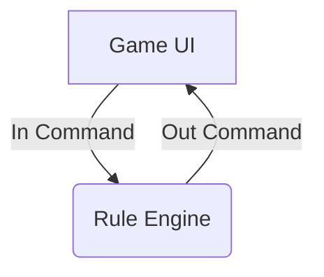

# drools-ttt(tic-tac-toe)

## env 

- windows 11
- openjdk 17
- Apache Maven 3.9.6
- Drools 10.0.0

```mermaid

flowchart TD
    A[Game UI] -->|In Command| B(Rule Engine)
    B -->|Out Command| A
```

