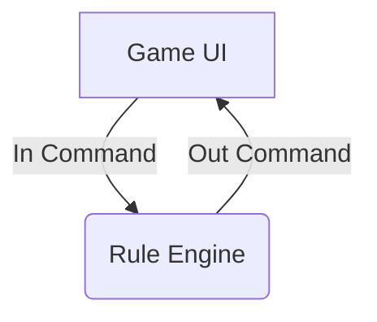

# drools-uttt(Ultimate Tic-Tac-Toe)

## env

- windows 11
- openjdk 17
- Apache Maven 3.9.6
- Drools 10.0.0

## structure

```mermaid

flowchart TD
    A[Game UI] -->|In Command| B(Rule Engine)
    B -->|Out Command| A
```

## how to play

Execute the main function to display the game UI.

